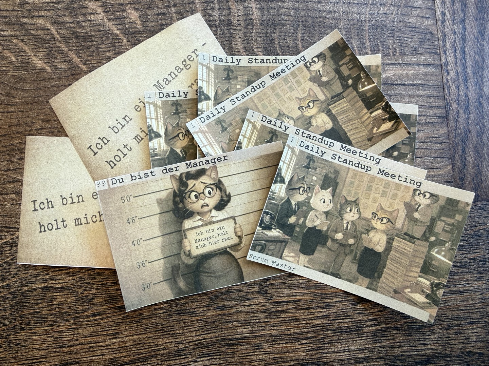
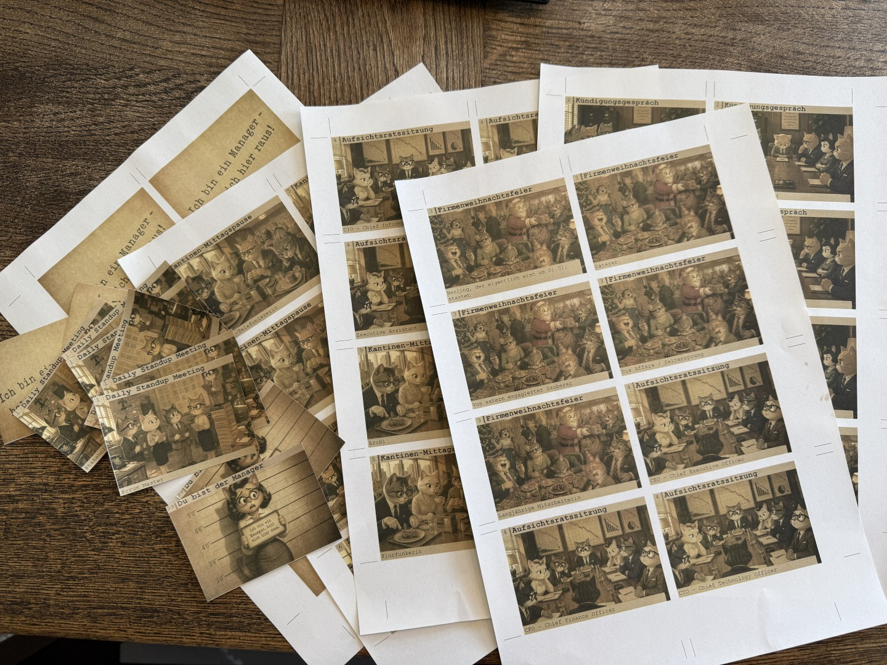

# Spyfall: Manager Edition or "I am a Manager - get me out of here!"

A card game for corporate settings, inspired by the original Spyfall. We call this version "I am a Manager - get me out of here!".

This game is not about manager bashing. It is actually the opposite. It is a tribute to a very real challenge: managers are often pulled into meetings simply because management attention is needed — without being told what the meeting is actually about. Once there, they face a near-impossible task: be useful, ask the right questions, and contribute meaningfully — all while not giving away that they have no idea what is going on.

In this game, one player takes on exactly that role. The Manager ends up in a meeting without knowing which one it is — and has to pretend otherwise. The other players know the scenario but not who the Manager is. Through questions and answers, everyone tries to expose the Manager while the Manager tries to blend in.

The game was collaboratively created and playtested at the **Agile Coach Camp Germany, June 2026, Rückersbach** by Irina Tolliszus, Hannah Schlamann, Martin Halfen, Martin Luig, Patrick Lehrbach, Frank Link, Tobias Wilmeroth and Udo Wiegärtner.

| | |
|---|---|
|  |  |

---

## How to use
You can print the pre-generated PDFs, cut out the cards and start playing right away.

In case you want to modify the content or add scenarios, you can do so using the descriptions below.

---

## Download

Ready-to-print PDFs (duplex, DIN A4):

- [spyfall_manager_edition_doublesided_DE.pdf](output/spyfall_manager_edition_doublesided_DE.pdf) - German version
- [spyfall_manager_edition_doublesided_EN.pdf](output/spyfall_manager_edition_doublesided_EN.pdf) - English version

Print settings: **duplex, flip on long edge**. Odd pages = front sides, even pages = back sides.

Scenario overview sheet (DIN A4, single-sided) — place this on the table during the game so all players can see which scenarios are in play at a glance:

- [spyfall_manager_edition_scenarios_DE.pdf](output/spyfall_manager_edition_scenarios_DE.pdf) - German version
- [spyfall_manager_edition_scenarios_EN.pdf](output/spyfall_manager_edition_scenarios_EN.pdf) - English version

---

## Scenarios

| # | German | English |
|---|---|---|
| 1 | Daily Standup Meeting | Daily Scrum Meeting |
| 2 | Kündigungsgesprach | Layoff Meeting |
| 3 | Firmenweihnachtsfeier | Corporate Christmas Party |
| 4 | Aufsichtsratssitzung | Board Meeting |
| 5 | Kantinen-Mittagspause | Lunch Break |
| 6 | ISO-Audit | ISO Audit |
| 7 | Brandschutzübung | Fire Drill |

---

## How to Play

- All players receive a card showing a meeting scenario and their role in it
- **One player** receives the Manager card -- they only know they are the Manager, not which meeting they are in
- All other players know the scenario but not who the Manager is
- Through questions and answers, players try to expose the Manager -- and the Manager tries to blend in

---

## Generate Your Own Cards

You can download and print the pre-generated cards. In case you want to modify or generate your own cards, here are the steps to do so.

### Prerequisites

Card generation currently runs **on Windows only**, as the batch file is Windows-specific.

#### 1. Install Ruby

Ruby is required for card generation.

- Download: https://rubyinstaller.org/ (recommended: Ruby+Devkit, current version)
- During installation, enable "Add Ruby executables to your PATH"
- Verify installation: `ruby --version` in the command line

Then install the Squib gem:

```
gem install squib
```

#### 2. Install PDFtk

PDFtk is required to create the double-sided PDF and for the page-count tests.

- Download: https://www.pdflabs.com/tools/pdftk-the-pdf-toolkit/
- Default installation path: `C:\Program Files (x86)\PDFtk\bin\pdftk.exe`
- If PDFtk is installed elsewhere, update the path in `start_card_generation.bat`

### Generate Cards

Run `start_card_generation.bat` from the project folder by double-clicking it or via the command line:

```
start_card_generation.bat [DE|EN|both]
```

The language parameter is optional. Default is `both` (generates DE and EN versions).

Generated PDFs are placed in the `output/` folder:

| File | Contents |
|---|---|
| `spyfall_manager_edition_frontsides_DE.pdf` / `_EN.pdf` | All front sides on DIN A4 |
| `spyfall_manager_edition_backsides_DE.pdf` / `_EN.pdf` | All back sides on DIN A4 |
| `spyfall_manager_edition_doublesided_DE.pdf` / `_EN.pdf` | Duplex: front and back alternating |
| `spyfall_manager_edition_scenarios_DE.pdf` / `_EN.pdf` | Scenario overview sheet (DIN A4, single-sided) |

### Printing and Cutting

For duplex printing, use the `_doublesided` PDF: odd pages are front sides, even pages are the corresponding back sides. In your printer settings, select "duplex, flip on long edge".

The back side PDF is generated with a mirrored card layout (`rtl: true` in Squib) so that front and back sides align correctly after flipping.

> **Important after cutting:** The cards are printed scenario by scenario. After cutting, sort the cards into sets — one set per scenario. Each set must include exactly **one Manager card** ("I am a Manager"). The Manager cards are printed at the end of the PDF (they share a common background image). Add one Manager card to each scenario set before playing.

---

## Adding New Scenarios

1. Open `card_data_front_sides.csv` (UTF-8 with BOM, semicolon-separated)
2. Add new rows for each role in the scenario (new `ScenarioNumber`)
3. Add one more row with `ScenarioNumber` = `99` and empty `RoleNameDE`/`RoleNameEN` (Manager card)
4. Place a matching background image in `images/` and reference it in `ScenarioImage`
5. Run `start_card_generation.bat`

The script reads all CSV rows automatically -- no code changes required.

---

## Project Structure

```
start_card_generation.bat          # Entry point for card generation (Windows)
card_generator.rb                  # Ruby/Squib script: front and back side PDFs
scenario_overview.rb               # Ruby/Squib script: scenario overview sheet
card_data_front_sides.csv          # Card content: scenarios and roles (DE + EN)
card_data_back_sides_and_misc.csv  # Back side content + misc texts per language
layout.yml                         # Squib layout definitions: positions, sizes, colors, fonts
images/                            # Background images and card backs
output/                            # Generated PDFs (not tracked in repository)
test/                              # Automated tests
```

---

## Development

Contributions are welcome - new scenarios, translations, and improvements. Both DE and EN columns are active in the CSV and both language versions are generated by default.

---

## Legal Notice

**Spyfall: Manager Edition** is an unofficial community variant and is not affiliated with or endorsed by the publisher of the original **Spyfall** game. All rights to the original game remain with their respective owners.

This variant is an independent fan work and makes no claim to the trademark or intellectual property of the original game.

---

## License

[](https://creativecommons.org/licenses/by-nc-sa/4.0/)

**I am a Manager - get me out of here! / Ich bin ein Manager - holt mich hier raus!**
Created 2026 by Irina Tolliszus, Hannah Schlamann, Martin Halfen, Martin Luig, Patrick Lehrbach, Frank Link, Tobias Wilmeroth, Udo Wiegärtner

Licensed under [Creative Commons Attribution-NonCommercial-ShareAlike 4.0 International (CC BY-NC-SA 4.0)](https://creativecommons.org/licenses/by-nc-sa/4.0/).

You are free to:
- **Share** - copy and redistribute the material in any medium or format
- **Adapt** - remix, transform, and build upon the material

Under the following terms:
- **Attribution (BY)** - You must give appropriate credit and name the authors listed above as the source
- **NonCommercial (NC)** - You may not use the material for commercial purposes
- **ShareAlike (SA)** - If you remix or adapt the material, you must distribute your contribution under the same license
